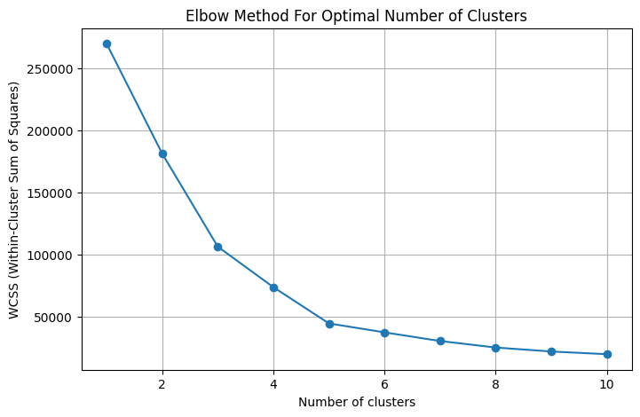
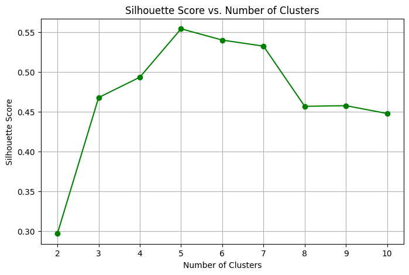
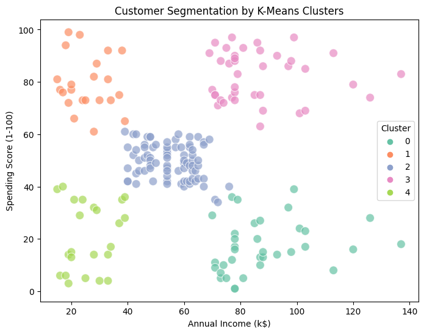

# Customer Segmentation with K-Means Clustering

This project performs customer segmentation using K-Means clustering on the Mall Customer dataset. The goal is to group customers based on their annual income and spending score.

## Dataset

The dataset used is [`Mall_Customers.csv`](https://www.kaggle.com/datasets/nelakurthisudheer/mall-customer-segmentation):
- CustomerID
- Gender
- Age
- Annual Income (k$)
- Spending Score (1-100)

## Technologies Used

- Python
- Pandas, NumPy
- Matplotlib, Seaborn
- Scikit-learn (KMeans,silhouette score)

## Steps Performed

1. **Data Preprocessing**
   - Checked for nulls
   - Label-encoded Gender

2. **Exploratory Data Analysis**
   - Pairplot of features
   - Summary statistics

3. **Clustering**
   - Used Elbow Method to determine optimal clusters (k=5)
   - Applied KMeans on `Annual Income` and `Spending Score`

4. **Visualization**
   - Cluster visualizations using Seaborn and Matplotlib
   - Group-wise cluster analysis

## Results

The KMeans model segmented customers into 5 clusters, which can help businesses target different customer groups for marketing strategies.

## Sample Visuals

### Elbow Method:

### Silhouette Score Method:

### Cluster Plot:

### Pairplot:

## Future Improvements
- Try clustering with additional features (e.g., Age)
- Visualize in 3D using Plotly

## How to Run

1. Clone this repo  
2. Install requirements  
